<div align="center">
  


---

## Network Security Detection Framework


**Passive, policy-driven network detection framework that performs kernel-assisted packet capture and deep packet inspection in user space to identify violations of defined security policies in live network traffic.**

[Architecture](docs/sentinelnet_overview.md) ·
[Policy Configuration](docs/policy_reference.md) ·
[Detection Logic](src/detections.py) ·
[Tests](tests/) ·
[Source](src/)

</div>

---

## Overview

SentinelNet is a passive network detection framework designed to identify insecure protocols, cleartext authentication, and legacy communication patterns that violate defined security policies in enterprise-style networks.

```mermaid
flowchart TB
    A["Policy Configuration<br/>Capture · Rules · Output)"] --> B["SentinelNet Core"]

    B --> C["Detection Engine<br/>Stateless Packet Evaluation"]
    C --> D["Alert Pipeline<br/>Structured Events"]

    D --> E1["Machine Output<br/>alerts.jsonl"]
    D --> E2["Human Output<br/>alerts.log / console"]

    F["Live Network Traffic"] --> B
```



The tool emphasizes **defensive visibility**, **policy-driven analysis**, and **explainable alerts**, modeling how SOC teams reason about network risk rather than focusing on raw packet capture or active enforcement.
SentinelNet is intended as a **research and learning framework** for understanding network security monitoring, protocol risk analysis, and detection engineering concepts in controlled lab environments.

## 📁 Repository Structure

- **`src/`**  
  Core detection engine and packet processing logic. Modules handle packet capture, protocol parsing, and policy evaluation.

- **`policies/`**  
  Configuration files defining allowed and disallowed protocols, authentication rules, and network behavior expectations.

- **`docs/`**  
  Detailed documentation covering detection logic, supported policy rules, and analysis methodology for each detection category.

- **`logs/`**  
  Structured alert and event logs generated by the detector (`.jsonl`, `.log`), suitable for ingestion into SIEM platforms or further analysis. 

- **`tests/`**  
  Controlled packet construction and validation tests used to verify detection accuracy. These tests simulate policy-violating traffic patterns for validation purposes only.

---

## 🔍 Detection Capabilities

### Disallowed Protocol Detection  
Identifies traffic using insecure or deprecated protocols such as FTP, Telnet, or other cleartext services that violate defined network policy.

### Cleartext Authentication Detection  
Inspects packet payloads to detect authentication credentials transmitted without encryption, including HTTP Basic Authentication and legacy login mechanisms.

### Internal Policy Violation Monitoring  
Flags traffic that violates explicitly defined policy rules, such as the use of disallowed ports or legacy name resolution services within internal networks.

### Legacy Service Identification  
Detects services commonly disabled in hardened environments, such as NetBIOS, LLMNR, or SMBv1, to highlight unnecessary attack surface.

Each detection generates a structured event describing:
- Source and destination context
- Protocol and service involved
- Policy rule violated
- Severity and justification

---

## 🚀 Getting Started

## Getting Started

This section outlines how to run SentinelNet locally after downloading or cloning the repository.

### Prerequisites

SentinelNet is developed and tested using **Python 3.11+**.  
Ensure Python and pip are installed and available in your system path.

Verify your installation:

```bash
python --version
pip --version
```

> [!NOTE]
> If Python is not installed, download it from:  
> https://www.python.org/downloads/

---

### Clone the Repository

```bash
git clone https://github.com/<your-username>/SentinelNet.git
cd SentinelNet
```

---

### Install Dependencies

SentinelNet relies on Scapy for packet capture and inspection.

Install required Python packages:

```bash
pip install -r requirements.txt
```

If running tests or modifying the detection logic, install pytest as well:

```bash
pip install pytest
```

Packet capture may require elevated privileges depending on your operating system and network interface.

---

### Running SentinelNet

The detection engine is executed from the `src/` directory and is driven by a JSON-based policy file located in `policies/` by default.

Basic example:

```bash
python src/sentinelnet.py
```

Common options:
- `--policy` : Path to the policy configuration file
- `--iface`  : Network interface to monitor
- `--count`  : Optional packet limit (0 = unlimited)

```bash
 python src/sentinelnet.py --policy policies/default.json --iface "Ethernet"
 ```

SentinelNet will begin passively capturing traffic and generating alerts based on the active policy rules.

---

### Alert Output

By default, SentinelNet generates:
- **Machine-readable alerts** (`alerts.jsonl`) suitable for parsing or SIEM ingestion
- **Human-readable logs** (`alerts.log`) for direct review

Output behavior and paths can be customized in the policy file.

---

### Verification

SentinelNet includes unit tests that validate detection behavior using constructed packets.

From the project root, run:

```bash
pytest
```

All tests should pass before modifying detection logic or policies

---
## 🧪 Generate Traffic

This section provides safe, reproducible commands that can be used to generate network activity and validate SentinelNet detection behavior.  
All examples below produce **real alerts** and populate both `alerts.jsonl` and `alerts.log`.

These actions are **benign test scenarios**, not exploits.

---

### Before You Begin

Ensure SentinelNet is running and actively capturing traffic:

```bash
python src/sentinelnet.py --policy policies/default.json --iface "Ethernet"
```

Notes:
- Some commands require a second machine or VM on the same network (recommended)
- Alternatively, target your router or another reachable LAN host
- Packet capture may require elevated privileges depending on your OS

---

### 1️⃣ Legacy Name Resolution (NBNS / LLMNR)

This detection is commonly triggered automatically on Windows systems but can be forced manually.

**Windows**

```cmd
ping nonexistentsentinelhost
```

**Why this works**
- Windows attempts LLMNR / NBNS name resolution
- Generates UDP traffic on ports 5355 (LLMNR) or 137 (NBNS)
- SentinelNet logs `LEGACY_NAME_RESOLUTION`

This is the fastest way to generate immediate alert output.

---

### 2️⃣ Disallowed Port Detection (FTP / Telnet / SMB)

#### FTP (TCP 21)

```bash
ftp <target-ip>
```

Even a failed connection attempt is sufficient.

**Expected alert**
- `DISALLOWED_PORT`
- `service: FTP`

---

#### Telnet (TCP 23)

```bash
telnet <target-ip>
```

Triggers immediately on connection attempt.

---

#### SMB (TCP 445)

**Linux / WSL**

```bash
nc <target-ip> 445
```

**Windows**

```cmd
net use \\<target-ip>\share
```

---

### 3️⃣ HTTP Basic Authentication (Cleartext Credentials)

This is one of SentinelNet’s most visible detections.

#### Using curl (recommended)

```bash
curl -u testuser:testpass http://<target-ip>/
```

**Why this works**
- Sends an `Authorization: Basic <base64>` header
- SentinelNet detects and decodes the credential payload
- Logs `CLEARTEXT_HTTP_BASIC_AUTH`
- Evidence field is populated when possible

---

#### Using PowerShell

```powershell
$pair = "user:pass"
$bytes = [System.Text.Encoding]::UTF8.GetBytes($pair)
$encoded = [Convert]::ToBase64String($bytes)

Invoke-WebRequest http://<target-ip>/ -Headers @{
  Authorization = "Basic $encoded"
}
```

---

### 4️⃣ FTP Cleartext Credential Detection (USER / PASS)

```bash
ftp <target-ip>
```

Then enter:

```
USER testuser
PASS testpass
```

**Expected alert**
- `FTP_CLEARTEXT_CREDENTIALS`
- Evidence may include extracted username and password (best effort)

---

### 5️⃣ Mixed Traffic (Multiple Detections)

Run the following commands in quick succession:

```bash
ping fakehost123
curl -u admin:admin http://<target-ip>/
ftp <target-ip>
telnet <target-ip>
```

This will generate:
- Legacy name resolution alerts
- HTTP Basic Authentication alerts
- Disallowed port alerts
- FTP cleartext credential alerts

This scenario is ideal for demonstrating multiple detections back-to-back in the log files.

---

### 6️⃣ Optional: Manual UDP Legacy Traffic

To explicitly trigger legacy UDP detections:

```bash
nc -u <target-ip> 137
nc -u <target-ip> 5355
```

---

### Expected Output

After running the commands above, SentinelNet will generate alerts such as:
- `LEGACY_NAME_RESOLUTION`
- `DISALLOWED_PORT`
- `CLEARTEXT_HTTP_BASIC_AUTH`
- `FTP_CLEARTEXT_CREDENTIALS`

Alerts will include:
- Varying severity levels
- Different protocol and service identifiers
- Evidence fields where applicable
- Clean, UTC timestamps

---

### Documentation Tip

For documentation or demonstration purposes:
- Run SentinelNet in one terminal
- Generate test traffic in another
- Capture screenshots of:
  - Console output
  - `alerts.jsonl`
  - `alerts.log`

This provides a clear, end-to-end demonstration of SentinelNet’s detection capabilities.

---

## License

This project is licensed under the [MIT License](LICENSE).
