<div align="center">
  


---

## Network Security Detection Framework


**Passive, policy-driven network detection framework that performs kernel-assisted packet capture and deep packet inspection in user space to identify violations of defined security policies in live network traffic.**

[Architecture](docs/architecture.md) ·
[Policy Configuration](docs/policy.md) ·
[Detection Logic](src/detections.py) ·
[Tests](tests/) ·
[Source](src/)

</div>

---

## Overview

SentinelNet is a passive network detection framework designed to identify insecure protocols, cleartext authentication, and legacy communication patterns that violate defined security policies in enterprise-style networks.

```mermaid
flowchart TB
    A["Policy Configuration<br/>Capture · Rules · Output)"] --> B["SentinelNet Core"]

    B --> C["Detection Engine<br/>Stateless Packet Evaluation"]
    C --> D["Alert Pipeline<br/>Structured Events"]

    D --> E1["Machine Output<br/>alerts.jsonl"]
    D --> E2["Human Output<br/>alerts.log / console"]

    F["Live Network Traffic"] --> B
```



The tool emphasizes **defensive visibility**, **policy-driven analysis**, and **explainable alerts**, modeling how SOC teams reason about network risk rather than focusing on raw packet capture or active enforcement.
SentinelNet is intended as a **research and learning framework** for understanding network security monitoring, protocol risk analysis, and detection engineering concepts in controlled lab environments.

## 📁 Repository Structure

- **`src/`**  
  Core detection engine and packet processing logic. Modules handle packet capture, protocol parsing, and policy evaluation.

- **`policies/`**  
  Configuration files defining allowed and disallowed protocols, authentication rules, and network behavior expectations.

- **`docs/`**  
  Detailed documentation covering detection logic, supported policy rules, and analysis methodology for each detection category.

- **`logs/`**  
  Structured alert and event logs generated by the detector (`.jsonl`, `.log`), suitable for ingestion into SIEM platforms or further analysis. 

- **`tests/`**  
  Controlled packet construction and validation tests used to verify detection accuracy. These tests simulate policy-violating traffic patterns for validation purposes only.

---

## 🔍 Detection Capabilities

### Disallowed Protocol Detection  
Identifies traffic using insecure or deprecated protocols such as FTP, Telnet, or other cleartext services that violate defined network policy.

### Cleartext Authentication Detection  
Inspects packet payloads to detect authentication credentials transmitted without encryption, including HTTP Basic Authentication and legacy login mechanisms.

### Internal Policy Violation Monitoring  
Flags traffic that violates explicitly defined policy rules, such as the use of disallowed ports or legacy name resolution services within internal networks.

### Legacy Service Identification  
Detects services commonly disabled in hardened environments, such as NetBIOS, LLMNR, or SMBv1, to highlight unnecessary attack surface.

Each detection generates a structured event describing:
- Source and destination context
- Protocol and service involved
- Policy rule violated
- Severity and justification

---

## 🚀 Getting Started

## Getting Started

This section outlines how to run SentinelNet locally after downloading or cloning the repository.

### Prerequisites

SentinelNet is developed and tested using **Python 3.11+**.  
Ensure Python and pip are installed and available in your system path.

Verify your installation:

```bash
python --version
pip --version
```

> [!NOTE]
> If Python is not installed, download it from:  
> https://www.python.org/downloads/

---

### Clone the Repository

```bash
git clone https://github.com/<your-username>/SentinelNet.git
cd SentinelNet
```

---

### Install Dependencies

SentinelNet relies on Scapy for packet capture and inspection.

Install required Python packages:

```bash
pip install -r requirements.txt
```

If running tests or modifying the detection logic, install pytest as well:

```bash
pip install pytest
```

Packet capture may require elevated privileges depending on your operating system and network interface.

---

### Running SentinelNet

The detection engine is executed from the `src/` directory and is driven by a JSON-based policy file located in `policies/`.

Basic example:

```bash
python src/sentinelnet.py --policy policies/default.json --iface "Ethernet"
```

Common options:
- `--policy` : Path to the policy configuration file
- `--iface`  : Network interface to monitor
- `--count`  : Optional packet limit (0 = unlimited)

SentinelNet will begin passively capturing traffic and generating alerts based on the active policy rules.

---

### Alert Output

By default, SentinelNet generates:
- **Machine-readable alerts** (`alerts.jsonl`) suitable for parsing or SIEM ingestion
- **Human-readable logs** (`alerts.log`) for direct review

Output behavior and paths can be customized in the policy file.

---

### Running Tests

SentinelNet includes unit tests that validate detection behavior using constructed packets.

From the project root, run:

```bash
pytest
```

All tests should pass before modifying detection logic or policies


---

## License

This project is licensed under the [MIT License](LICENSE).
