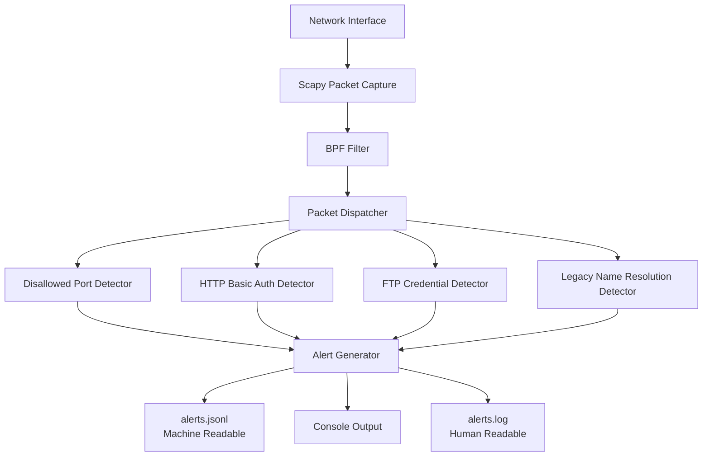

# SentinelNet Overview

SentinelNet is a passive, policy-driven network detection tool designed to identify insecure or legacy network behavior through packet-level inspection. It operates as a lightweight visibility layer, producing structured alerts suitable for SOC workflows and human review.

---

## Purpose

SentinelNet is built to:
- Detect insecure protocols and authentication mechanisms
- Highlight policy violations in internal or edge networks
- Provide explainable, event-based alerts without active interference

SentinelNet intentionally avoids intrusion prevention, packet manipulation, or traffic blocking.

---

## High-Level Architecture

SentinelNet follows a simple, stream-based processing model:

Packet Capture  
→ Detector Engine  
→ Alert Generation  
→ Log Output

Each packet is processed independently. When a policy condition is met, an alert is generated and logged immediately.

---

## Detection Model

- Stateless packet inspection
- One packet evaluated at a time
- No packet buffering or stream reconstruction
- All detection behavior controlled via policy configuration

This design favors stability, low resource usage, and predictable behavior.

---

## Output Model

SentinelNet produces two forms of output:
- JSONL alerts for machine ingestion and automation
- Human-readable log entries for manual review

Both outputs are generated from the same alert event.

---

## Intended Use

SentinelNet is intended for:
- Learning and experimentation
- Home lab and internal network visibility
- Demonstrating detection engineering concepts

It is not intended to replace full IDS or NDR platforms.
