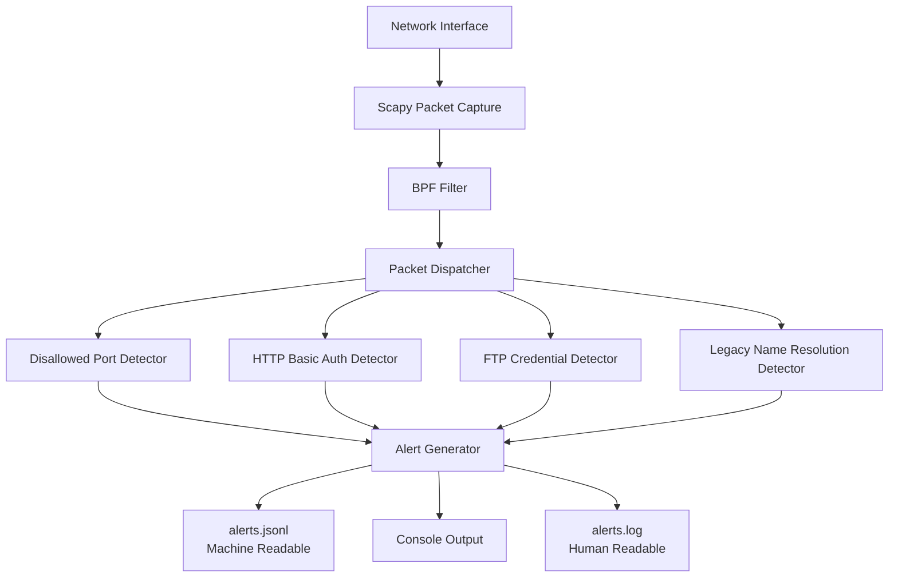

# SentinelNet Overview

SentinelNet is a passive, policy-driven network detection framework designed to identify insecure or legacy network behavior through packet-level inspection. It operates as a lightweight visibility layer, producing structured alerts suitable for SOC workflows as well as direct human review.

---

## Purpose

SentinelNet is built to:
- Detect insecure protocols and cleartext authentication mechanisms
- Highlight explicit policy violations in internal or edge networks
- Provide explainable, event-based alerts without active interference

SentinelNet intentionally avoids intrusion prevention, packet manipulation, traffic blocking, or inline enforcement.

---

## High-Level Architecture

SentinelNet follows a simple, stream-based processing model:

Packet Capture → Detector Engine → Alert Generation → Log Output

Each packet is processed independently. When a policy condition is met, an alert is generated and logged immediately.

---

## Detection Model

SentinelNet uses a deterministic, packet-level detection model:
- Stateless inspection of individual packets
- One packet evaluated at a time
- No packet buffering or TCP stream reconstruction
- All detection behavior controlled via explicit policy configuration

This design prioritizes stability, low resource usage, and predictable behavior over behavioral inference or anomaly modeling.

---

## Output Model

SentinelNet produces two synchronized forms of output:
- **JSONL alerts** intended for machine ingestion, automation, or SIEM pipelines
- **Human-readable log entries** intended for direct review and validation

Both outputs are derived from the same alert event and represent identical detection data.

---

## Intended Use

SentinelNet is intended for:
- Learning and experimentation
- Home lab and internal network visibility
- Demonstrating packet-level detection engineering concepts

It is not intended to replace full intrusion detection systems (IDS) or network detection and response (NDR) platforms.
